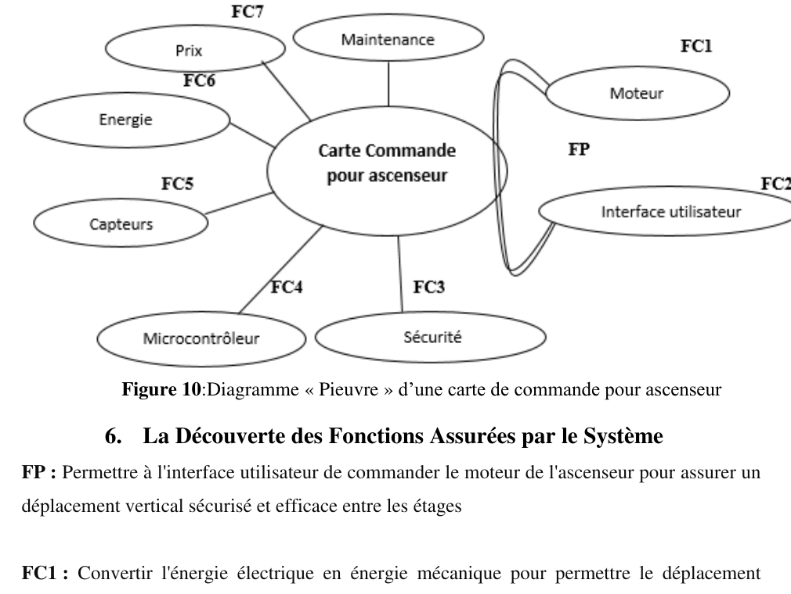
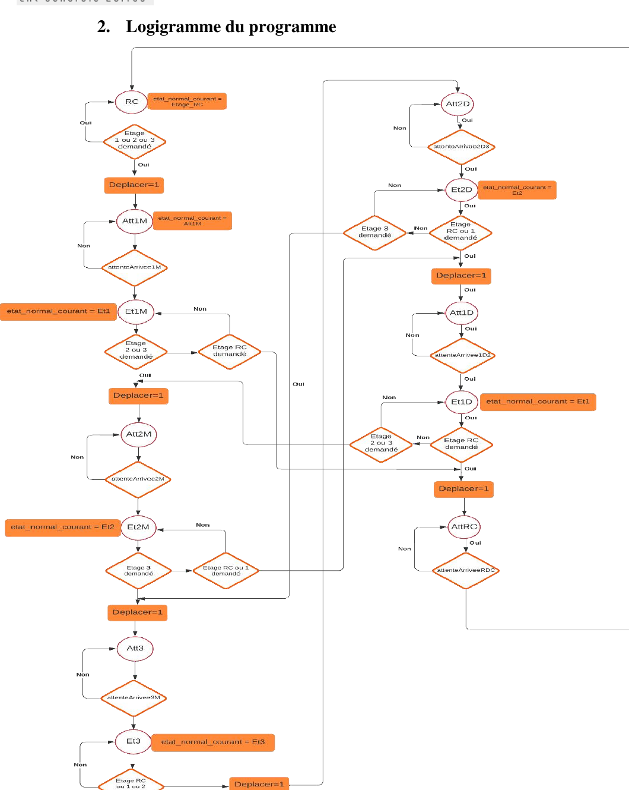
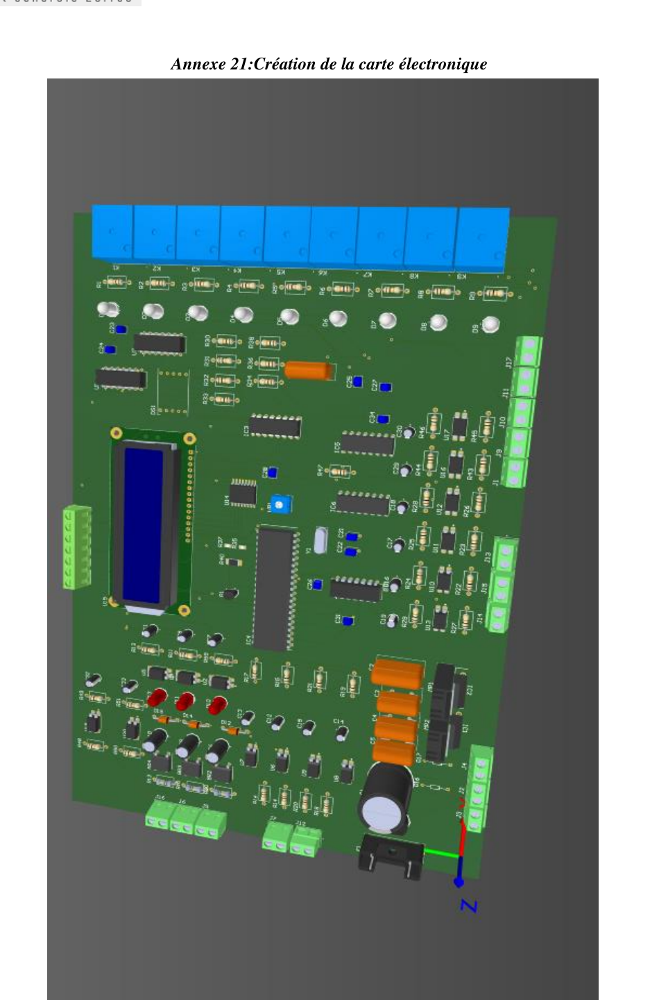
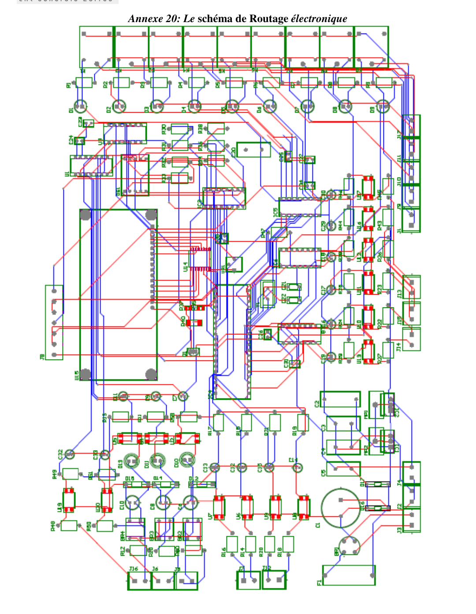

# PIC18F Elevator Control Board

Embedded elevator controller firmware and hardware documentation for a custom `PIC18F46K22`-based control board.

## Project Summary

This project was developed as a final-year engineering project in electromechanics to design a local elevator control board that is easier to maintain, less dependent on imported hardware, and better adapted to real industrial needs.

The repository brings together:
- embedded firmware for a 4-level elevator controller
- state-machine-based control logic
- board support and relay control modules
- PCB design visuals and system documentation extracted from the final report

## GitHub Description

`PIC18F46K22 elevator control board with a finite state machine, relay control, safety logic, and custom PCB design.`

## Objectives

- Design a dedicated elevator control board around the `PIC18F46K22`
- Control cabin movement, door actions, and floor indication
- Integrate safety-related inputs and technician mode behavior
- Build a maintainable firmware structure that is easier to debug and extend
- Reduce dependence on imported controller boards by proposing a local solution

## Key Features

- Finite state machine for elevator movement between ground floor, floor 1, floor 2, and floor 3
- Normal operating mode and technician mode
- Relay-based control for up, down, high-speed, and low-speed motion
- Door management and floor display handling
- Safety-oriented behavior using dedicated inputs, contactor feedback, and interrupts
- Command-line build with `MPLAB XC8`

## System Overview

The control architecture is centered around a `PIC18F46K22` microcontroller. Inputs collect floor requests, sensor edges, limit switch states, manual maintenance commands, and safety events. The firmware processes these signals through a state machine, then drives the elevator relays, door outputs, and display logic.

The codebase is structured so that application logic, board support, and platform-specific startup code are clearly separated.

## Visual Overview

### Functional View



### Program Logic



### PCB Design



### PCB Routing



## Control Logic

The firmware implements a state machine that manages elevator behavior according to the active mode and the requested floor.

In normal mode, the controller:
- reads calls from floor buttons or serial commands
- starts movement in the correct direction
- switches between high-speed and low-speed travel
- counts sensor events to detect position changes
- stops the cabin on the requested floor
- opens and closes the door once arrival is confirmed

In technician mode, the controller:
- allows manual up and down control
- keeps door and motor actions under controlled conditions
- separates maintenance behavior from normal passenger operation

## Firmware Structure

```text
firmware/
  include/
    app/
      elevator_control.h
      elevator_state_machine.h
    bsp/
      input_config.h
      output_config.h
    platform/
      eusart1.h
      interrupt_manager.h
      mcc.h
      system_init.h
  src/
    app/
      main.c
      elevator_control.c
      elevator_state_machine.c
    bsp/
      input_config.c
      output_config.c
    platform/
      eusart1.c
      interrupt_manager.c
      mcc.c
      system_init.c
docs/
  assets/
  project-structure.md
```

## Build

This repository can be built from the command line with `MPLAB XC8`.

Requirements:
- `xc8-cc`
- `PIC18F-K_DFP`

Build commands:

```bash
make
make clean
make print-config
```

Main outputs:
- `build/elevator.production.elf`
- `build/elevator.production.hex`

## Hardware Platform

- Microcontroller: `PIC18F46K22`
- Relay outputs for motion and auxiliary control
- Floor request inputs
- Limit switches and movement sensors
- Safety-related inputs
- Seven-segment display support
- Serial communication support

## Documentation Source

Some diagrams and PCB visuals included in this README 
